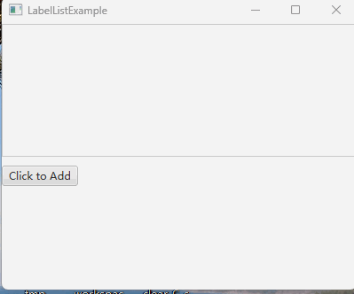

# 如何为布局增加滚动条_使用ScrollPane

当我们使用某些布局时候，比如VBox，其容纳的控件超过了显示大小时，我们可能无法看到这些控件。

解决方案是为Vbox增加一个滚动条，从而可以滚动地显示更多内容，这就要用到 ScrollPane 。

ScrollPane 是一种特殊的控件，它可以设置一个布局作为其内容，然后为其在合适的时候增加一个滚动条。

## 效果展示



## 示例代码

我们的示例代码制作了一个叫做 LabelList 的工具，它的作用是在VBox中可以动态地不断添加Label，当显示窗口容纳不下时，就会有滚动条出现。

下面是 LabelList 的实现：

```java
import javafx.scene.control.Control;
import javafx.scene.control.Label;
import javafx.scene.control.ScrollPane;
import javafx.scene.layout.VBox;

public class LabelList
{
    private ScrollPane scrollPane;
    private VBox listPane;
    private int maxLabelCount;
    private boolean addToBottom;

    public LabelList(int maxLabelCount, boolean addToBottom)
    {
        listPane = new VBox();

        scrollPane = new ScrollPane();
        scrollPane.setContent(listPane);
        scrollPane.setFitToWidth(true); // 不显示横向滚动条

        this.maxLabelCount = maxLabelCount;

        this.addToBottom = addToBottom;
    }

    public Control getControl()
    {
        return scrollPane;
    }

    public Label addLabel(String labelText)
    {
        if (listPane.getChildren().size() >= maxLabelCount)
        {
            if (addToBottom)
            {
                listPane.getChildren().remove(0);
            }
            else
            {
                listPane.getChildren().remove(listPane.getChildren().size() - 1);
            }
        }

        if (addToBottom)
        {
            scrollPane.setVvalue(1.0); // 自动下拉到底部
        }

        Label label = new Label(labelText);
        label.setPrefWidth(scrollPane.getWidth() * 0.99);

        label.setOnMouseEntered((e) -> {
            label.setStyle("-fx-background-color: #F0F8FF;");
        });
        label.setOnMouseExited((e) -> {
            label.setStyle("-fx-background-color: transparent;");
        });

        if (addToBottom)
        {
            listPane.getChildren().add(label);
        }
        else
        {
            listPane.getChildren().add(0, label);
        }

        return label;
    }
}
```

测试代码：
```java
import javafx.application.Application;
import javafx.scene.Scene;
import javafx.scene.control.Button;
import javafx.scene.layout.VBox;
import javafx.stage.Stage;

public class LabelListExample extends Application
{
    private int counter = 0;

    @Override
    public void start(Stage window) throws Exception
    {
        VBox root = new VBox();
        root.setSpacing(10);

        LabelList list = new LabelList(50, true);
        list.getControl().prefHeightProperty().bind(root.heightProperty().divide(2));

        Button button = new Button("Click to Add");
        button.setOnAction(e -> {
            counter++;
            list.addLabel("Hello World " + counter);
        });

        root.getChildren().addAll(list.getControl(), button);

        Scene scene = new Scene(root, 400, 300);

        window.setScene(scene);
        window.setTitle(this.getClass().getSimpleName());
        window.show();
    }

    public static void main(String[] args)
    {
        launch(args);
    }
}
```

**代码说明**

我们通过下面的代码，创建了 ScrollPane ，并且设置了其内容，同时不开启横向滚动条：
```java
scrollPane = new ScrollPane();
scrollPane.setContent(listPane);
scrollPane.setFitToWidth(true); // 不显示横向滚动条
```

接下来我们提供了一个 addLabel 函数，它向VBox中添加了一个Label。这个Label是添加到VBox中的，而ScrollPane却可以自动对Vbox进行调整。

测试代码中，每点击一次Button，就会调用一次 addLabel 来添加Label。

我们使用 `list.getControl().prefHeightProperty().bind(root.heightProperty().divide(2));` 来设置 LabelList 的高度，随时保持和窗口高度的一半一致。

## 总结

要实现布局增加滚动条的效果，需要按照以下步骤进行操作：

1. 创建一个ScrollPane对象。
2. 将要滚动显示的布局设置为ScrollPane的内容（即一个布局）。
3. 根据需要设置ScrollPane的滚动条属性，如横向滚动条的显示与否。
4. 可选：根据需要调整LabelList的高度与窗口高度的关联关系。

之后，我们向布局中添加内容，ScrollPane就会自动进行调整。