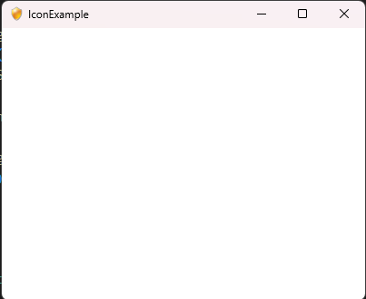

# 如何为程序添加ICON

程序图标位于窗口的左上角，也位于任务栏中。

JavaFX 可以使用一张 png 图片来设置图标。

## 效果展示



## 示例代码

```java
import javafx.application.Application;
import javafx.scene.Scene;
import javafx.scene.image.Image;
import javafx.scene.layout.StackPane;
import javafx.stage.Stage;

public class IconExample extends Application
{
    @Override
    public void start(Stage window) throws Exception
    {
        // Image 的 url 是 classpath 的相对目录，也可以是一个绝对目录
        Image image = new Image("resource/icon.png");
        window.getIcons().add(image);
        StackPane root = new StackPane();

        Scene scene = new Scene(root, 400, 300);

        window.setTitle(this.getClass().getSimpleName());
        window.setScene(scene);
        window.show();
    }

    public static void main(String[] args)
    {
        launch(args);
    }
}
```

**代码说明**

这段代码创建了一个 Image 对象，其图片资源位于 `resource/icon.png` 。

程序会从 classpath 中寻找这个资源。

接着代码调用 `window.getIcons().add(image)` 设置了程序的图标。
