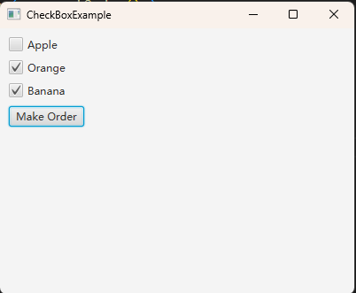

# 如何使用CheckBox以获取用户的选择

CheckBox 是一个复选框，它有两种状态：选中和非选中。

CheckBox 可以比较直观的表现用户的选择情况。

## 效果展示



## 示例代码

```java
import java.util.Map;
import java.util.TreeMap;

import javafx.application.Application;
import javafx.geometry.Insets;
import javafx.scene.Scene;
import javafx.scene.control.Button;
import javafx.scene.control.CheckBox;
import javafx.scene.layout.VBox;
import javafx.stage.Stage;

public class CheckBoxExample extends Application
{
    private Map<Integer, CheckBox> orderMap; // id -> CheckBox

    private void getOrder()
    {
        Map<Integer, String> orderedFruits = new TreeMap<>();
        for (Map.Entry<Integer, CheckBox> entry : orderMap.entrySet())
        {
            CheckBox checkBox = entry.getValue();
            int id = entry.getKey();
            if (checkBox.isSelected())
            {
                orderedFruits.put(id, checkBox.getText());
            }
        }

        if (orderedFruits.isEmpty())
        {
            System.out.println("You have no order");
        }
        else
        {
            System.out.println("Your order is: " + orderedFruits);
        }
    }

    @Override
    public void start(Stage window) throws Exception
    {
        VBox vBox = new VBox();
        vBox.setPadding(new Insets(10));
        vBox.setSpacing(10);

        CheckBox appleCheckBox = new CheckBox("Apple");
        CheckBox orangeCheckBox = new CheckBox("Orange");
        CheckBox bananaCheckBox = new CheckBox("Banana");
        
        orderMap = new TreeMap<>();
        orderMap.put(1, appleCheckBox);
        orderMap.put(2, orangeCheckBox);
        orderMap.put(3, bananaCheckBox);

        Button orderButton = new Button("Make Order");
        orderButton.setOnAction(e -> getOrder() );

        vBox.getChildren().addAll(
            appleCheckBox,
            orangeCheckBox,
            bananaCheckBox,
            orderButton);

        Scene scene = new Scene(vBox, 400, 300);

        window.setScene(scene);
        window.setTitle(this.getClass().getSimpleName());
        window.show();
    }

    public static void main(String[] args)
    {
        launch(args);
    }
}
```

**代码说明**

这段代码创建了三个 CheckBox 代表三种可选水果，并将其放到一个 Map 中，这样做的目的是可以为每一个可选水果进行编号。

当点击按钮后，通过 `checkBox.isSelected()` 判断 CheckBox 的选中状态，从而收集当前选择的水果。

## 总结

- 使用 CheckBox 可以轻松获取用户的选择
- 通过将 CheckBox 放入 Map 中，我们可以对 CheckBox 进行编号