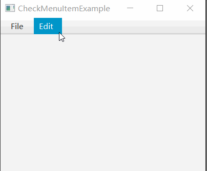

# 如何使用CheckMenuItem添加可选菜单项

CheckMenuItem 也是一种菜单项目，类似 CheckBox ，拥有可选状态。

CheckMenuItem 可以添加到菜单中。

## 效果展示



## 示例代码

```java {40-51}
import javafx.application.Application;
import javafx.scene.Scene;
import javafx.scene.control.CheckMenuItem;
import javafx.scene.control.Menu;
import javafx.scene.control.MenuBar;
import javafx.scene.control.MenuItem;
import javafx.scene.control.SeparatorMenuItem;
import javafx.scene.layout.VBox;
import javafx.stage.Stage;

public class CheckMenuItemExample extends Application
{
    private Stage window;
    private MenuBar menuBar;

    private void exitProgram()
    {
        this.window.close();
    }

    private void buildMenu()
    {
        menuBar = new MenuBar();

        Menu fileMenu = new Menu("_File");
        menuBar.getMenus().add(fileMenu);

        MenuItem newMenuItem = new MenuItem("_New File");
        fileMenu.getItems().add(newMenuItem);
        MenuItem openMenuItem = new MenuItem("_Open File");
        fileMenu.getItems().add(openMenuItem);
        fileMenu.getItems().add(new SeparatorMenuItem());
        MenuItem exitMenuItem = new MenuItem("_Exit");
        fileMenu.getItems().add(exitMenuItem);
        exitMenuItem.setOnAction( e-> exitProgram() );

        Menu editMenu = new Menu("_Edit");
        menuBar.getMenus().add(editMenu);

        CheckMenuItem showLineNumber = new CheckMenuItem("Show _Line Number");
        showLineNumber.setOnAction(e -> {
            if (showLineNumber.isSelected())
            {
                System.out.println("Show line number");
            }
            else
            {
                System.out.println("Do not show line number");
            }
        });
        editMenu.getItems().add(showLineNumber);
    }

    @Override
    public void start(Stage window) throws Exception
    {
        this.window = window;

        VBox vBox = new VBox();

        this.buildMenu();
        vBox.getChildren().add(menuBar);

        Scene scene = new Scene(vBox, 400, 300);

        window.setScene(scene);
        window.setTitle(this.getClass().getSimpleName());
        window.show();
    }

    public static void main(String[] args)
    {
        launch(args);
    }
}
```

**代码说明**

`new CheckMenuItem("Show _Line Number")` 创建了一个可选菜单项，`_L` 表示 ALT+L 组成选择快捷键。

点击菜单项后，可以触发由 `showLineNumber.setOnAction` 设置的回调函数，无论当前是选中，还是未选择，都会触发。

## 总结

为了使用 CheckMenuItem，可以按照以下步骤进行操作：

1. 创建一个 CheckMenuItem 对象，并将其添加到相应的菜单中
2. 使用 setOnAction 方法为 CheckMenuItem 设置事件处理程序，以便在用户点击菜单项时触发相应的操作