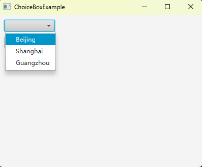
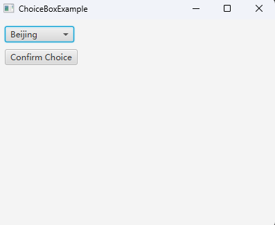

# 如何使用ChoiceBox以接收用户的单项选择

ChoiceBox 是一种下拉框，点击后显示可选列表，从中可以再点击选择一个选项。

ChoiceBox 可以用于接收用户的单项选择。

## 效果展示





## 示例代码

```java
import javafx.application.Application;
import javafx.geometry.Insets;
import javafx.scene.Scene;
import javafx.scene.control.Button;
import javafx.scene.control.ChoiceBox;
import javafx.scene.layout.VBox;
import javafx.stage.Stage;

public class ChoiceBoxExample extends Application
{
    static class CityItem
    {
        private int id;
        private String name;

        public CityItem(int id, String name)
        {
            this.id = id;
            this.name = name;
        }

        public int getId() { return id; }
        public String getName() { return name; }
        public String toString() { return name; }
    }

    private ChoiceBox<CityItem> countryChoiceBox;

    private void getChoice()
    {
        CityItem cityItem = countryChoiceBox.getValue();
        if (cityItem == null)
        {
            System.out.println("You haven't make a choice yet");
        }
        else
        {
            System.out.println(String.format("id: %d, name: %s", cityItem.getId(), cityItem.getName()));
        }
    }

    @Override
    public void start(Stage window) throws Exception
    {
        VBox vBox = new VBox();
        vBox.setPadding(new Insets(10));
        vBox.setSpacing(10);

        countryChoiceBox = new ChoiceBox<>();
        countryChoiceBox.getItems().add(new CityItem(1, "Beijing"));
        countryChoiceBox.getItems().add(new CityItem(2, "Shanghai"));
        countryChoiceBox.getItems().add(new CityItem(3, "Guangzhou"));

        Button button = new Button("Make Choice");
        button.setOnAction( e -> getChoice() );

        vBox.getChildren().addAll(countryChoiceBox, button);

        Scene scene = new Scene(vBox, 400, 300);

        window.setScene(scene);
        window.setTitle(this.getClass().getSimpleName());
        window.show();
    }

    public static void main(String[] args)
    {
        launch(args);
    }
}
```

**代码说明**

- `private ChoiceBox<CityItem> countryChoiceBox;` 定义了一个 ChoiceBox ，每个条目存放的是自定义类型 CityItem
- `CityItem` 重写了 toString 方法，ChoiceBox 的条目显示的是其返回的字符串
- `countryChoiceBox.getValue` 返回一个 `CityItem` ，当未做出选择时它将返回 null

## 如何监听用户选择事件

有时我们希望在用户选择后立刻做出响应，而非点击按钮才从 ChoiceBox 中获取当前选项。

我们可以通过调用 `setOnAction` 方法来设置一个回调函数，以达到这个目的：

```java
countryChoiceBox.setOnAction( e-> getChoice() );
```

## 总结

ChoiceBox提供了一种简单而直观的方式来接收用户的单项选择。

可以提供一个自定义类型（重写了 toString 方法）作为 ChoiceBox 的 Item 。

可以通过 getValue 方法获取 ChoiceBox 中当前选择的 Item 。