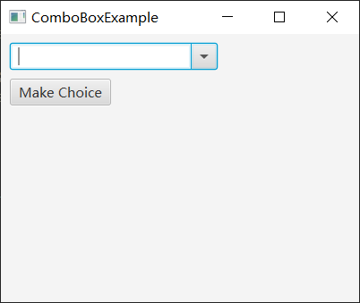
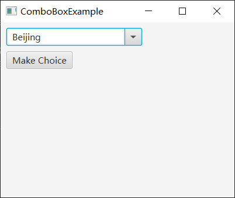

# 如何使用ComboBox以获取用户的单选并可编辑

ComboBox 是一种单选下拉框，和 ChoiceBox 很类似。

ComboBox 不仅可以接收用户的一个选项，还可以提供可编辑框，让用户输入内容。

## 效果展示





## 示例代码

```java
import javafx.application.Application;
import javafx.geometry.Insets;
import javafx.scene.Scene;
import javafx.scene.control.Button;
import javafx.scene.control.ComboBox;
import javafx.scene.layout.VBox;
import javafx.stage.Stage;

public class ComboBoxExample extends Application
{
    static class CityItem
    {
        private int id;
        private String name;

        public CityItem(int id, String name)
        {
            this.id = id;
            this.name = name;
        }

        public int getId() { return id; }
        public String getName() { return name; }
        public String toString() { return name; }
    }

    private ComboBox<CityItem> countryComboBox;

    private void getChoice()
    {
        String text = countryComboBox.getEditor().getText();
        for (CityItem cityItem : countryComboBox.getItems())
        {
            if (cityItem.getName().equals(text))
            {
                System.out.println(String.format("id: %d, name: %s", cityItem.getId(), cityItem.getName()));
                return;
            }
        }

        System.out.println("no such city: " + text);
    }

    @Override
    public void start(Stage window) throws Exception
    {
        VBox vBox = new VBox();
        vBox.setPadding(new Insets(10));
        vBox.setSpacing(10);

        countryComboBox = new ComboBox<>();
        countryComboBox.getItems().add(new CityItem(1, "Beijing"));
        countryComboBox.getItems().add(new CityItem(2, "Shanghai"));
        countryComboBox.getItems().add(new CityItem(3, "Guangzhou"));
        countryComboBox.setEditable(true);

        Button button = new Button("Make Choice");
        button.setOnAction( e -> getChoice() );

        vBox.getChildren().addAll(countryComboBox, button);

        Scene scene = new Scene(vBox, 400, 300);

        window.setScene(scene);
        window.setTitle(this.getClass().getSimpleName());
        window.show();
    }

    public static void main(String[] args)
    {
        launch(args);
    }
}
```

**代码说明**

这段代码基本上和 ChoiceBox 的示例一样。

不同点在于：

- 调用 `countryComboBox.setEditable(true);` 将 ComboBox 设置成可编辑，从而用户可以输入、拷贝内容
- 修改获取选项的方法，改用 `String text = countryComboBox.getEditor().getText();` 获取内容，这是因为如果使用 `comboBox.getValue()` 将无法得到正确的类型从而引发异常
- 获取当前 comboBox 的内容后，我们通过 for 循环查询匹配的选项，完成 `comboBox.getValue()` 的功能

## 总结

ComboBox 和 ChoiceBox 类似，都提供了下拉框功能，并接收用户的一个单选选项。

ComboBox 比之 ChoiceBox ，可以提供可编辑的功能，调用 `comboBox.setEditable(true);` 即可实现。

但由于启动了可编辑，我们不能再使用 `comboBox.getValue()` 方法获取自定义的类型，因为此时可能导致类型转化错误。

替代方案是使用 `comboBox.getEditor().getText();` 来获取当前选项的文本，再通过匹配查找得到对应的选项。