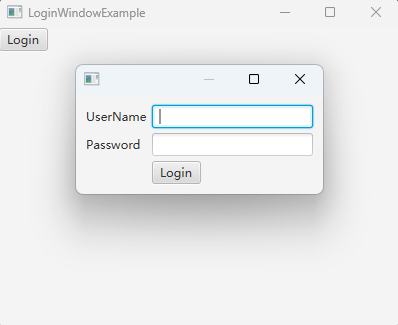

# 如何使用GridPane 以创建一个登录框为例

GridPane 可以看成是一个二维表格，它的默认行数和列数都是 0。也就是说，如果你创建一个空的 GridPane 对象，它将没有任何行和列。

当你向 GridPane 中添加组件时，GridPane 会自动根据组件的位置和跨度计算出所需的行数和列数，并自动扩展网格以适应组件。

比如下面的登录框采用了 GridPane 作为根布局：



这是一个三行两列的一个二维表：
- 第一行第一列放的是一个 Label ，内容是 userName 
- 第一行第二列放的是一个 TextField ，用来接受用户名的输入
- 第二行第一列放的是一个 Label ，内容是 password
- 第二行第二列放的是一个 TextField ，用来接收密码的输入
- 第三行第二列放的是一个 Button ，用来确认登录

第三行第一列空了出来，没有放任何控件。

## 完整代码

### LoginWindow.java

```java
import javafx.geometry.Insets;
import javafx.scene.Scene;
import javafx.scene.control.Button;
import javafx.scene.control.Label;
import javafx.scene.control.TextField;
import javafx.scene.layout.GridPane;
import javafx.stage.Modality;
import javafx.stage.Stage;

public class LoginWindow 
{
    private Stage window;
    private boolean isLoginSucc;

    private void confirmLogin(String userName, String password)
    {
        if (userName.equals("test") && password.equals("123456"))
        {
            isLoginSucc = true;
        }

        window.close();
    }

    public boolean open()
    {
        isLoginSucc = false;

        Label userNameLabel = new Label("UserName");
        TextField userNameTextField = new TextField();

        Label passwordLabel = new Label("Password");
        TextField passwordTextField = new TextField();

        Button confirmButton = new Button("Login");
        confirmButton.setOnAction(e -> confirmLogin(userNameTextField.getText(), passwordTextField.getText()));

        GridPane gridPane = new GridPane();
        gridPane.setPadding(new Insets(10));
        gridPane.setVgap(5);
        gridPane.setHgap(5);
        gridPane.add(userNameLabel, 0, 0);
        gridPane.add(userNameTextField, 1, 0);
        gridPane.add(passwordLabel, 0, 1);
        gridPane.add(passwordTextField, 1, 1);
        gridPane.add(confirmButton, 1, 2);

        Scene scene = new Scene(gridPane);

        window = new Stage();
        window.setScene(scene);
        window.initModality(Modality.APPLICATION_MODAL);
        window.showAndWait();

        return isLoginSucc;
    }
}
```

代码说明：
- `gridPane.setVgap` 设置格子纵向的间隔
- `gridPane.setHgap` 设置格子横向的间隔
- 通过调用 `gridPane.add(Node, col, row)` 方法，将组件放到某一个格子上
- 我们没有设置窗口和Scene的大小，因此它们的大小会根据控件自动调整

### 测试代码：LoginWindowExample.java

```java
import javafx.application.Application;
import javafx.scene.Scene;
import javafx.scene.control.Button;
import javafx.scene.layout.VBox;
import javafx.stage.Stage;

public class LoginWindowExample extends Application
{
    @Override
    public void start(Stage window) throws Exception
    {
        VBox vBox = new VBox();

        Button loginButton = new Button("Login");
        loginButton.setOnAction(e -> System.out.println("is login: " + new LoginWindow().open()) );
        vBox.getChildren().add(loginButton);

        Scene scene = new Scene(vBox, 400, 300);

        window.setScene(scene);
        window.setTitle(this.getClass().getSimpleName());
        window.show();
    }

    public static void main(String[] args)
    {
        launch(args);
    }
}
```

## 总结

- GridPane 是一个二维表格布局，可用于创建复杂的用户界面。
- 通过向 GridPane 添加组件，可以自动计算所需的行数和列数，并自动调整网格大小以适应组件。
- GridPane的 setVgap 和 setHgap 可用于设置格子见的距离。
- 通过调用 `gridPane.add(Node, col, row)` 方法，可以将组件放置在指定的格子中。
- 使用GridPane可以轻松地创建登录框等复杂布局。