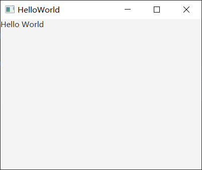

# 如何使用JavaFX写一个HelloWorld窗口

## 准备工作

首先我们需要安装好 JDK ，我使用 JDK1.8 来做开发，而 JDK1.8 内置了 JavaFX ，所以不需要从外部引入依赖。

在这里下载 JDK1.8: 

```
链接：https://pan.baidu.com/s/1xPj1izE39ucJYKPvGSrbIQ?pwd=1111 
提取码：1111
```

打开命令提示行验证一下自己的 JDK 版本：

```
> javac -version
javac 1.8.0_261
```

接下来我们需要一个 IDE 开发环境，可以使用 IDEA 社区版本。

在这里下载 IDEA 社区版本：

```
链接：https://pan.baidu.com/s/1pTnDUT7vqgdgnlJOMjDQJA?pwd=1111 
提取码：1111
```

> 或者去[官网](https://www.jetbrains.com.cn/idea/download/#section=windows)下载最新的版本。

## 编写 HelloWorld 程序

新建一个空目录，然后在此目录中创建一个文件 HelloWorld.java 。

编写下面的代码：

```java
import javafx.application.Application;
import javafx.scene.Scene;
import javafx.scene.control.Label;
import javafx.scene.layout.VBox;
import javafx.stage.Stage;

public class HelloWorld extends Application
{
    @Override
    public void start(Stage window) throws Exception
    {
        VBox vBox = new VBox();

        Label label = new Label("Hello World");
        vBox.getChildren().add(label);

        Scene scene = new Scene(vBox, 400, 300);

        window.setScene(scene);
        window.setTitle(this.getClass().getSimpleName());
        window.show();
    }

    public static void main(String[] args)
    {
        launch(args);
    }
}
```

然后用 IDEA 打开这个目录，第一次打开可能需要指定SDK，跟着它的引导来选择 JDK1.8 就行。

> PS: 如果像我这样，使用JDK1.8的，则不能使用 IDEA 来创建 JavaFX 程序，因为 IDEA 创建的是更高版本的，需要 JDK11。

在 IDEA 中，我们可以直接运行 HelloWorld ，运行结果如下：



看起来比较丑陋，但是没关系！我们的目的是搭建一个基本的开发环境，以便进行后续的学习和开发。所以这样一个简单的程序就足够了。

## 程序解释

基本的 JavaFX 程序需要做这几件事情：

1. 继承 Application
2. 重写方法 start
3. main 方法调用 launch

接下来，我们就只需要关注如何编写 start 方法：

1. 创建一个 Layout（比如上面的 VBox ）
2. 创建一些控件，放到 Layout 里面（比如上面的 Label）
3. 创建一个场景 Scene ，将 Layout 传给它
4. 将 Scene 传给 Stage (即窗口 window) ，然后调用 window.show 来显示窗口

