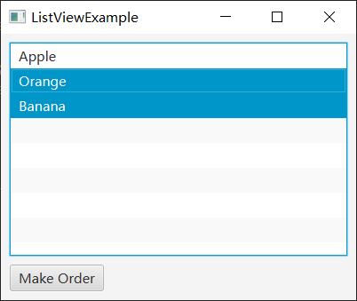

# 如何使用ListView以提供一个选择列表给用户

ListView 是一个列表框控件。

它可以在一个垂直滚动区域中显示一个项目列表，并允许用户进行选择。

## 效果展示



## 示例代码

```java
import javafx.application.Application;
import javafx.collections.ObservableList;
import javafx.geometry.Insets;
import javafx.scene.Scene;
import javafx.scene.control.Button;
import javafx.scene.control.ListView;
import javafx.scene.control.SelectionMode;
import javafx.scene.layout.VBox;
import javafx.stage.Stage;

public class ListViewExample extends Application
{
    private ListView<String> fruitsListView;

    private void getOrder()
    {
        ObservableList<String> selectedItems = fruitsListView.getSelectionModel().getSelectedItems();
        if (selectedItems.isEmpty())
        {
            System.out.println("You haven't make order yet");
        }
        else
        {
            System.out.println("Your order is:");
            for (String item : selectedItems)
            {
                System.out.println(item);
            }
        }
    }

    @Override
    public void start(Stage window) throws Exception
    {
        VBox vBox = new VBox();
        vBox.setPadding(new Insets(10));
        vBox.setSpacing(10);

        fruitsListView = new ListView<>();
        fruitsListView.getSelectionModel().setSelectionMode(SelectionMode.MULTIPLE); // 设置可多选
        fruitsListView.getItems().addAll("Apple", "Orange", "Banana");

        Button button = new Button("Make Order");
        button.setOnAction( e -> getOrder() );

        vBox.getChildren().addAll(fruitsListView, button);

        Scene scene = new Scene(vBox, 400, 300);

        window.setScene(scene);
        window.setTitle(this.getClass().getSimpleName());
        window.show();
    }

    public static void main(String[] args)
    {
        launch(args);
    }
}
```

**代码说明**

- `fruitsListView = new ListView<>();` 创建了一个 ListView ，我们用它表示可选择的水果
- `fruitsListView.getSelectionModel().setSelectionMode(SelectionMode.MULTIPLE);` 表示列表可多选（按住CTRL或SHIFT时），否则默认是单选
- `ObservableList<String> selectedItems = fruitsListView.getSelectionModel().getSelectedItems();` 用于获得当前已选列表

## 总结

使用 ListView 提供一个选择列表给用户的简单步骤如下：

1. 创建一个 ListView 对象，并设置其显示模式和选择模式。可以使用 new ListView<>() 来创建一个空的 ListView，然后使用 setSelectionMode() 方法设置选择模式，如 SelectionMode.MULTIPLE 表示可多选。

2. 将项目添加到 ListView 中。使用 getItems().addAll() 方法将项目添加到 ListView 中。每个项目通常是一个字符串，表示用户可以选择的选项。

3. 注册事件处理程序。如果需要在用户选择项目时执行特定操作，可以注册事件处理程序。例如，可以为按钮添加一个事件处理程序，当用户点击按钮时，获取当前选中的项目并执行相应的操作。

4. 显示 ListView。将 ListView 放置在一个容器（如 VBox）中，并将容器添加到场景图中。