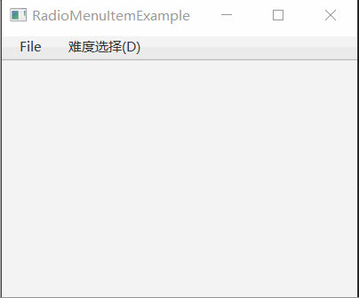

# 如何使用RadioMenuItem添加单选菜单项

几个 RadioMenuItem 可以组成一个组合，组合中只能有一个菜单条目被选择。

## 效果展示



## 示例代码

```java {38-50}
import javafx.application.Application;
import javafx.scene.Scene;
import javafx.scene.control.Menu;
import javafx.scene.control.MenuBar;
import javafx.scene.control.MenuItem;
import javafx.scene.control.RadioMenuItem;
import javafx.scene.control.SeparatorMenuItem;
import javafx.scene.control.ToggleGroup;
import javafx.scene.layout.VBox;
import javafx.stage.Stage;

public class RadioMenuItemExample extends Application
{
    private Stage window;
    private MenuBar menuBar;

    private void exitProgram()
    {
        this.window.close();
    }

    private void buildMenu()
    {
        menuBar = new MenuBar();

        Menu fileMenu = new Menu("_File");
        menuBar.getMenus().add(fileMenu);

        MenuItem newMenuItem = new MenuItem("_New File");
        fileMenu.getItems().add(newMenuItem);
        MenuItem openMenuItem = new MenuItem("_Open File");
        fileMenu.getItems().add(openMenuItem);
        fileMenu.getItems().add(new SeparatorMenuItem());
        MenuItem exitMenuItem = new MenuItem("_Exit");
        fileMenu.getItems().add(exitMenuItem);
        exitMenuItem.setOnAction( e-> exitProgram() );

        Menu difficultMenu = new Menu("难度选择(_D)");
        menuBar.getMenus().add(difficultMenu);

        ToggleGroup diffToggleGroup = new ToggleGroup();
        RadioMenuItem easy = new RadioMenuItem("简单");
        easy.setSelected(true);
        easy.setToggleGroup(diffToggleGroup);
        RadioMenuItem medium = new RadioMenuItem("中等");
        medium.setToggleGroup(diffToggleGroup);
        RadioMenuItem hard = new RadioMenuItem("困难");
        hard.setToggleGroup(diffToggleGroup);
        
        difficultMenu.getItems().addAll(easy, medium, hard);
    }

    @Override
    public void start(Stage window) throws Exception
    {
        this.window = window;

        VBox vBox = new VBox();

        this.buildMenu();
        vBox.getChildren().add(menuBar);

        Scene scene = new Scene(vBox, 400, 300);

        window.setScene(scene);
        window.setTitle(this.getClass().getSimpleName());
        window.show();
    }

    public static void main(String[] args)
    {
        launch(args);
    }
}
```

**代码说明**

我们通过 `new ToggleGroup()` 创建了一个组合，在组合中的菜单项目是互斥的，同时只能选择一个。

`new RadioMenuItem` 是单选菜单项，在创建后调用 `setToggleGroup` 设置所属组合。

`setSelected(true)` 可以设置菜单默认选中状态，否则为未选择。

## 总结

为了使用 RadioMenuItem，可以按照以下步骤进行操作：

1. 创建一个 ToggleGroup 对象，用于组织一组互斥的 RadioMenuItem
2. 创建 RadioMenuItem 对象，并将其添加到相应的菜单中
3. 将 RadioMenuItem 添加到 ToggleGroup 中，以确保在同一组中只能选择一个选项
4. 使用 setSelected 方法为某个 RadioMenuItem 设置默认选中状态（可选）
5. 可以使用 setOnAction 方法为 RadioMenuItem 设置事件处理程序，以便在用户选择该选项时触发相应的操作