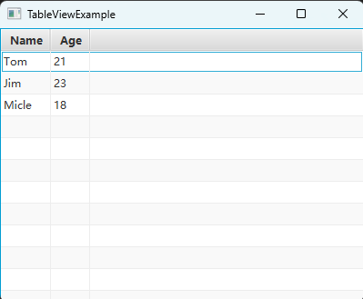

# 如何使用TableView展示表格数据

TableView 可以展示一个行列二维表格。表格由表头和记录组成。

表头由若干 TableColumn 组成。

通过定义 TableView 的代码：

```java
TableView<Student> studentTableView;
```

可以看出，记录的数据结构就是其模板参数。

我们可以把 Student 的 getXxx 方法映射到一个表格中，从而完成记录的创建。

## 效果展示



## 示例代码

```java
import javafx.application.Application;
import javafx.scene.Scene;
import javafx.scene.control.TableColumn;
import javafx.scene.control.TableView;
import javafx.scene.control.cell.PropertyValueFactory;
import javafx.scene.layout.VBox;
import javafx.stage.Stage;

public class TableViewExample extends Application
{
    public static class Student 
    {
        private String name;
        private int age;
    
        public Student(String name, int age)
        {
            this.name = name;
            this.age = age;
        }
    
        public String getName() { return name; }
        public int getAge() { return age; }
    }
    

    private TableView<Student> studentTableView;

    private void onSelectItem(Student item)
    {
        System.out.println(String.format("name: %s, age: %d", item.getName(), item.getAge()));
    }

    private void buildStudentTableView()
    {
        studentTableView = new TableView<>();
        studentTableView.getSelectionModel().selectedItemProperty().addListener((observable, oldValue, newValue) -> onSelectItem(newValue) );
        
        TableColumn<Student, String> nameColumn = new TableColumn<>("Name");
        nameColumn.setCellValueFactory(new PropertyValueFactory<>("name"));
        TableColumn<Student, String> ageColumn = new TableColumn<>("Age");
        ageColumn.setCellValueFactory(new PropertyValueFactory<>("age"));
        
        studentTableView.getColumns().add(nameColumn);
        studentTableView.getColumns().add(ageColumn);

        studentTableView.getItems().add(new Student("Tom", 21));
        studentTableView.getItems().add(new Student("Jim", 23));
        studentTableView.getItems().add(new Student("Micle", 18));
    }

    @Override
    public void start(Stage window) throws Exception
    {
        VBox vBox = new VBox();

        this.buildStudentTableView();
        vBox.getChildren().add(studentTableView);

        Scene scene = new Scene(vBox, 400, 300);

        window.setScene(scene);
        window.setTitle(this.getClass().getSimpleName());
        window.show();
    }

    public static void main(String[] args)
    {
        launch(args);
    }
}
```

**代码说明**

- 这段代码由三部分组成：
    1. 定义了一个结构 Student ，其每个实例对应 TableView 的一个记录，每个字段对应 TableView 的表头列
    2. `buildStudentTableView` 用于创建 TableView ，并填充其内容
    3. `start` 函数创建了场景图，然后把创建好的 TableView 添加进去从而显示
- `studentTableView.getSelectionModel().selectedItemProperty().addListener` 添加了用户选择记录时的监听事件
- `new TableColumn<>` 用于创建表头列，`setCellValueFactory` 方法用于绑定 Student 的 getXxx 方法，从而在添加记录时设置对应的内容
- `studentTableView.getColumns().add` 添加一个表头列
- `studentTableView.getItems().add` 添加一个记录

## 总结

使用 TableView 展示表格数据的步骤如下：

1. 定义数据结构：创建一个与 TableView 记录对应的数据结构，每个字段对应一个表头列。在示例中，使用了 Student 类作为记录的数据结构，它有 name 和 age 两个字段
2. 创建TableView实例
3. 创建表头列：使用 TableColumn 类创建表头列，并使用 setCellValueFactory 方法将数据结构中的字段与表头列进行绑定。在示例中，创建了两个表头列( Name 和 Age )，并将它们与 Student 类的 name 和 age 字段进行绑定
4. 填充表格内容：使用 getItems 方法获取 TableView 的数据项列表，并使用 add 方法添加记录
5. 设置事件监听：如果需要对用户选择记录进行响应，可以使用 selectionModel 的 selectedItemProperty 方法添加监听器来监听用户选择的记录