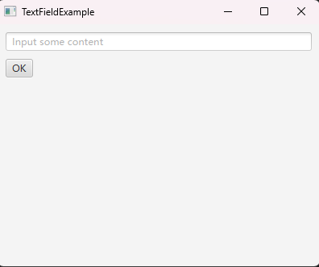

# 如何使用TextField接收用户的输入

TextField 是单行输入框，可以在里面编辑文本，从而得到用户的输入。

TextField 的显示效果如下：



## 示例代码

```java
import javafx.application.Application;
import javafx.application.Platform;
import javafx.geometry.Insets;
import javafx.scene.Scene;
import javafx.scene.control.Button;
import javafx.scene.control.TextField;
import javafx.scene.layout.VBox;
import javafx.stage.Stage;

public class TextFieldExample extends Application
{
    private void handleInput(String input)
    {
        System.out.println(input);
    }

    @Override
    public void start(Stage window) throws Exception
    {
        VBox vBox = new VBox();
        vBox.setPadding(new Insets(10));
        vBox.setSpacing(10);
        Platform.runLater(() -> vBox.requestFocus() ); // 在显示窗口后，取消所有可视控件的焦点

        TextField textField = new TextField();
        textField.setPromptText("Input some content");

        Button button = new Button("OK");
        button.setOnAction(e -> handleInput(textField.getText()) );

        vBox.getChildren().addAll(textField, button);

        Scene scene = new Scene(vBox, 400, 300);

        window.setScene(scene);
        window.setTitle(this.getClass().getSimpleName());
        window.show();
    }

    public static void main(String[] args)
    {
        launch(args);
    }
}
```

代码说明：
- `textField.setPromptText` 的作用是在用户未输入任何文本时，显示一个灰色的提示文本，以指导用户输入内容
- 通过 `textField.getText()` 获取输入的文本
- `handleInput` 方法简单地将输入的内容打印到控制台
- `Platform.runLater(() -> vBox.requestFocus() );` 是一段特殊的代码，作用是在窗口显示后把焦点放到 vBox 上

## 总结

我们可以通过 TextField 控件获取用户的输入。