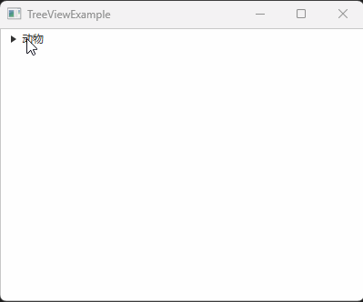

# 如何使用TreeView展示树状数据

TreeView 是一个可用于显示树形数据结构的UI组件。它提供了一个可折叠、可展开的树状视图。

TreeView 是一个树状结构，其根节点的类型是 TreeItem 。

每个 TreeItem 又可以包含若干 TreeItem 。由此可组成一颗树形结构。

## 效果展示



## 示例代码

```java
import javafx.application.Application;
import javafx.scene.Scene;
import javafx.scene.control.TreeItem;
import javafx.scene.control.TreeView;
import javafx.scene.layout.VBox;
import javafx.stage.Stage;

public class TreeViewExample extends Application
{
    private TreeView<String> animalTreeView;

    private void onSelectItem(String item)
    {
        System.out.println(item);
    }

    private void buildAnimalTreeView()
    {
        animalTreeView = new TreeView<>();
        TreeItem<String> root = new TreeItem<>("动物");
        animalTreeView.setRoot(root);

        // 监听当前的选择
        animalTreeView.getSelectionModel().selectedItemProperty().addListener( 
            (observable, oldValue, newValue) -> onSelectItem(newValue.getValue()) 
        );

        TreeItem<String> birdTree = new TreeItem<>("鸟类");
        birdTree.getChildren().add(new TreeItem<>("麻雀"));
        birdTree.getChildren().add(new TreeItem<>("乌鸦"));
        birdTree.getChildren().add(new TreeItem<>("燕子"));
        root.getChildren().add(birdTree);

        TreeItem<String> mammalTree = new TreeItem<>("哺乳类");
        mammalTree.getChildren().add(new TreeItem<String>("猫"));
        mammalTree.getChildren().add(new TreeItem<String>("狗"));
        mammalTree.getChildren().add(new TreeItem<String>("兔子"));
        root.getChildren().add(mammalTree);
    }

    @Override
    public void start(Stage window) throws Exception
    {
        VBox vBox = new VBox();

        this.buildAnimalTreeView();
        vBox.getChildren().add(animalTreeView);

        Scene scene = new Scene(vBox, 400, 300);

        window.setScene(scene);
        window.setTitle(this.getClass().getSimpleName());
        window.show();
    }

    public static void main(String[] args)
    {
        launch(args);
    }
}
```

**代码说明**

- `buildAnimalTreeView` 方法用于构建一个 TreeView ，内容是一个动物描述的示例
- `animalTreeView = new TreeView<>();` 用于创建一个新的 TreeView
- `new TreeItem<>("xxx");` 用于创建一个 TreeItem
- `animalTreeView.setRoot` 设置根 TreeItem
- `tree.getChildren().add` 可以为 TreeItem 添加子 TreeItem
- `animalTreeView.getSelectionModel().selectedItemProperty().addListener` 添加了一个监听回调函数，当用户点击选择了某个 TreeItem 时触发

## 总结

使用TreeView展示树状数据的步骤如下：

1. 创建一个 TreeView 对象
2. 创建一个根节点 TreeItem ，并将其设置为 TreeView 的根节点
3. 通过创建新的 TreeItem 对象构建树形结构。每个 TreeItem 对象可以包含子节点，以此组成完整的树形结构
4. 可为 TreeView 添加事件监听器
