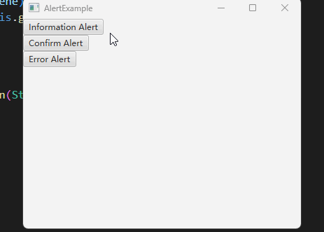

# 如何使用默认提示框Alert

Alert 是 JavaFX 自带的一个窗口，提供了一些默认的样式供我们选择：

- 提示框
- 确认框
- 错误框

默认情况下，当打开一个 Alert 时，其他的窗口无法进行操作。

我们还可以获取对 Alert 窗口操作的结果。

## 效果展示



## 示例代码

```java
import java.util.Optional;

import javafx.application.Application;
import javafx.scene.Scene;
import javafx.scene.control.Alert;
import javafx.scene.control.Button;
import javafx.scene.control.ButtonType;
import javafx.scene.control.Alert.AlertType;
import javafx.scene.layout.VBox;
import javafx.stage.Stage;

public class AlertExample extends Application
{
    @Override
    public void start(Stage window) throws Exception
    {
        VBox root = new VBox();

        Button informationButton = new Button("Information Alert");
        informationButton.setOnAction(e -> {
            Alert alert = new Alert(AlertType.INFORMATION);
            alert.setTitle("Hi");
            alert.setHeaderText(null);
            alert.setContentText("Hi there");
            alert.showAndWait();
        });

        Button confirmButton = new Button("Confirm Alert");
        confirmButton.setOnAction(e -> {
            Alert alert = new Alert(AlertType.CONFIRMATION);
            alert.setTitle("Confirm");
            alert.setHeaderText(null);
            alert.setContentText("Are you sure?");
            Optional<ButtonType> option = alert.showAndWait();
            System.out.println(option.get());
            if (option.get().equals(ButtonType.OK))
            {
                System.out.println("Choose OK");
            }
            else if (option.get().equals(ButtonType.CANCEL))
            {
                System.out.println("Choose CANCEL");
            }
        });

        Button errorButton = new Button("Error Alert");
        errorButton.setOnAction(e -> {
            Alert alert = new Alert(AlertType.ERROR);
            alert.setTitle("Error");
            alert.setHeaderText(null);
            alert.setContentText("Your program has got an error");
            alert.showAndWait();
        });

        root.getChildren().addAll(informationButton, confirmButton, errorButton);

        Scene scene = new Scene(root, 400, 300);

        window.setScene(scene);
        window.setTitle(this.getClass().getSimpleName());
        window.show();
    }

    public static void main(String[] args)
    {
        launch(args);
    }
}
```

**代码说明**

这段代码创建了三个按钮，每个按钮创建一个不同的 Alert ，分别是：

- 提示框，Alert 类型是 AlertType.INFORMATION
- 确认框，Alert 类型是 AlertType.CONFIRMATION
- 错误框，Alert 类型是 AlertType.ERROR

创建好 Alert 后，我们为其设置 Title，Header，Content，我们把 Header 设置成 null ，因为一般我们不需要这个内容。

接着调用 alert.showAndWait 方法打开 Alert 窗口。

确认框中，我们还接收了 showAndWait 的返回值，返回类型是 `Optional<ButtonType> option` ，我们通过 get() 方法拿到存储在里面的 ButtonType 对象，如果点击了确认，那么此对象为 ButtonType.OK ，如果是取消，此对象为 ButtonType.CANCEL 。这样我们就能知道用户的选择了。

## 总结

使用Alert的简洁步骤如下：

1. 创建Alert对象，指定AlertType类型，如INFORMATION（信息提示）、CONFIRMATION（确认）或ERROR（错误）。
2. 设置Alert的标题、头部和内容。通常将头部设置为null。
3. 调用alert.showAndWait()方法显示Alert窗口。
4. 对于确认框，可以使用showAndWait()方法返回的`Optional<ButtonType>`对象获取用户的选择结果。通过get()方法获取ButtonType，判断用户是点击了确认还是取消按钮。