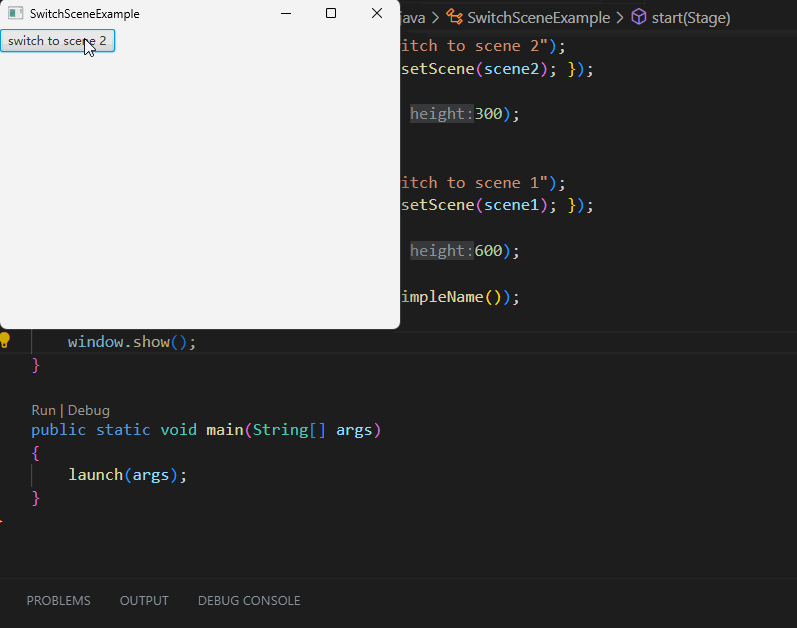

# 如何切换场景

在 JavaFX 中，一个窗口（Stage）中有一个 Scene 。所有的布局和控件都会在在个场景中。

我们可以通过切换 Scene 来完全改变一个窗口里的内容。

比如这样： `window.setScene(scene)` 。

窗口的大小会和 Scene 的大小一样，所以切换完 Scene 后，窗口的大小就变成新的 Scene 的大小了。

下面是一个切换场景的例子：



当点击按钮后，窗口的场景随之切换，因为我们设置了按钮的事件回调，并在处理函数中调用了 setScene 方法来切换场景。

## 代码示例

```java
import javafx.application.Application;
import javafx.scene.Scene;
import javafx.scene.control.Button;
import javafx.scene.layout.Pane;
import javafx.scene.layout.VBox;
import javafx.stage.Stage;

public class SwitchSceneExample extends Application
{
    private Scene scene1;
    private Scene scene2;

    @Override
    public void start(Stage window) throws Exception
    {
        Pane root1 = new VBox();
        Button button1 = new Button("switch to scene 2");
        button1.setOnAction((e) -> { window.setScene(scene2); });
        root1.getChildren().add(button1);
        scene1 = new Scene(root1, 400, 300);

        Pane root2= new VBox();
        Button button2 = new Button("switch to scene 1");
        button2.setOnAction((e) -> { window.setScene(scene1); });
        root2.getChildren().add(button2);
        scene2 = new Scene(root2, 800, 600);

        window.setTitle(this.getClass().getSimpleName());
        window.setScene(scene1);
        window.show();
    }

    public static void main(String[] args)
    {
        launch(args);
    }
}
```

## 总结

- 切换场景可以完全改变窗口内的内容
- 通过如 `window.setScene(scene)` 这样的方法来切换场景
- 场景切换后，窗口的大小会随之改变