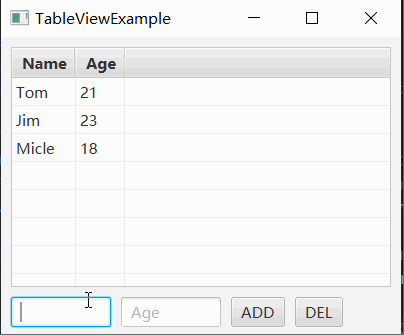

# 如何利用ObservableList为TableView添加Add和Del功能

TableView 的记录可以绑定到一个 ObservableList 。 ObservableList 是一种列表数据结构，继承自 List 。

很多 JavaFX 控件都可以用 ObservableList 管理动态数据。

利用 ObservableList 可以为 TableView 提供增加和删除数据的功能。

## 效果展示



## 示例代码

```java {65-68, 45-61}
import javafx.application.Application;
import javafx.collections.FXCollections;
import javafx.collections.ObservableList;
import javafx.geometry.Insets;
import javafx.scene.Scene;
import javafx.scene.control.Button;
import javafx.scene.control.TableColumn;
import javafx.scene.control.TableView;
import javafx.scene.control.TextField;
import javafx.scene.control.cell.PropertyValueFactory;
import javafx.scene.layout.HBox;
import javafx.scene.layout.VBox;
import javafx.stage.Stage;

public class TableViewExample extends Application
{
    public static class Student 
    {
        private String name;
        private int age;
    
        public Student(String name, int age)
        {
            this.name = name;
            this.age = age;
        }
    
        public String getName() { return name; }
        public int getAge() { return age; }
    }
    
    private TableView<Student> studentTableView;
    private ObservableList<Student> studentList;
    private TextField nameTextField;
    private TextField ageTextField;

    private void onSelectItem(Student item)
    {
        if (item != null)
        {
            System.out.println(String.format("name: %s, age: %d", item.getName(), item.getAge()));
        }
    }

    private void addStudent()
    {
        String name = nameTextField.getText();
        int age = Integer.parseInt(ageTextField.getText());

        Student student = new Student(name, age);
        studentList.add(student);

        nameTextField.clear();
        ageTextField.clear();
    }

    private void delStudent()
    {
        Student selectedItem = studentTableView.getSelectionModel().getSelectedItem();
        studentList.remove(selectedItem);
    }

    private void buildStudentTableView()
    {
        studentList = FXCollections.observableArrayList();

        studentTableView = new TableView<>();
        studentTableView.setItems(studentList);
        studentTableView.getSelectionModel().selectedItemProperty().addListener((observable, oldValue, newValue) -> onSelectItem(newValue) );
        
        TableColumn<Student, String> nameColumn = new TableColumn<>("Name");
        nameColumn.setCellValueFactory(new PropertyValueFactory<>("name"));
        TableColumn<Student, String> ageColumn = new TableColumn<>("Age");
        ageColumn.setCellValueFactory(new PropertyValueFactory<>("age"));
        
        studentTableView.getColumns().add(nameColumn);
        studentTableView.getColumns().add(ageColumn);

        studentList.add(new Student("Tom", 21));
        studentList.add(new Student("Jim", 23));
        studentList.add(new Student("Micle", 18));
    }

    private HBox buildInputLayout()
    {
        HBox hBox = new HBox();
        hBox.setSpacing(10);
        
        nameTextField = new TextField();
        nameTextField.setPromptText("Name");
        nameTextField.setPrefWidth(100);
        ageTextField = new TextField();
        ageTextField.setPromptText("Age");
        ageTextField.setPrefWidth(100);

        Button addButton = new Button("ADD");
        addButton.setOnAction(e -> addStudent() );
        Button delButton = new Button("DEL");
        delButton.setOnAction(e -> delStudent() );

        hBox.getChildren().addAll(nameTextField, ageTextField, addButton, delButton);

        return hBox;
    }

    @Override
    public void start(Stage window) throws Exception
    {
        VBox vBox = new VBox();
        vBox.setPadding(new Insets(10));
        vBox.setSpacing(10);

        this.buildStudentTableView();
        vBox.getChildren().add(studentTableView);

        HBox inputLayout = this.buildInputLayout();
        vBox.getChildren().add(inputLayout);

        Scene scene = new Scene(vBox, 400, 300);

        window.setScene(scene);
        window.setTitle(this.getClass().getSimpleName());
        window.show();
    }

    public static void main(String[] args)
    {
        launch(args);
    }
}
```

**代码说明**

下面的代码将 tableView 和 observableList 绑定到一起：

```java
studentList = FXCollections.observableArrayList();

studentTableView = new TableView<>();
studentTableView.setItems(studentList);
```

之后，对 studentList 的修改将直接应用到 studentTableView 上。

通过 `buildInputLayout` 方法创建了一个输入的操作面板，并实现一个 ADD 功能和一个 DEL 功能。

## 总结

使用 ObservableList 动态管理 TableView 的步骤如下：

1. 创建一个 ObservableList 对象，用于存储 TableView 的数据，并确保其泛型与 TableView 中的数据模型类型一致
2. 调用 TableView 的 setItems() 方法将 ObservableList 与 TableView 进行绑定
3. 在数据发生变化时，对 ObservableList 进行操作，这将自动反映在 TableView 中。可以使用 ObservableList 提供的方法，如 add() 和 remove() 来添加和删除数据