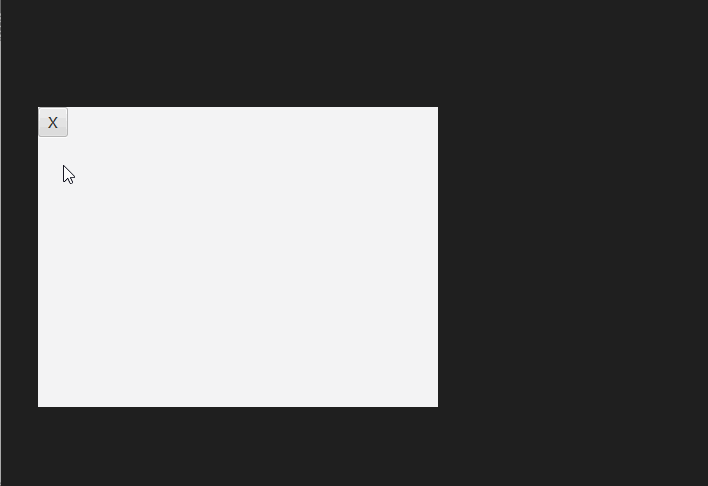

# 如何制作一个无标题栏且可拖拽的窗口

默认情况下，我们创建一个窗口自带有一个标题栏，标题栏上有程序的图标和标题，以及最小化、最大化、关闭按钮。

默认标题栏的样式比较固定，有时候为了自定义样式，就需要先隐藏默认的标题栏，然后自己制作一个。

同时有时还希望修改默认的拖拽窗口的方式（即按住标题栏拖动窗口），改成按住窗口空白区域即可拖拽。

下面的示例演示如何实现这些功能。

## 效果展示



## 示例代码

```java
import javafx.application.Application;
import javafx.scene.Scene;
import javafx.scene.control.Button;
import javafx.scene.layout.VBox;
import javafx.stage.Stage;
import javafx.stage.StageStyle;

public class DragWindowExample extends Application
{
    private Stage window;
    private VBox root;
    private double offsetX;
    private double offsetY;

    private void makeRootDraggeble()
    {
        // 鼠标场景位置(offset) = 鼠标屏幕位置 - 窗口屏幕位置
        // 拖拽鼠标移动窗口，实质上就是鼠标场景位置(offset)不变，同时修改窗口屏幕位置
        // 因此拖拽时，令 窗口屏幕位置 = 鼠标屏幕位置 - 鼠标场景位置(offset)
        root.setOnMousePressed(e -> {
            offsetX = e.getSceneX();
            offsetY = e.getSceneY();
        });

        root.setOnMouseDragged(e -> {
            window.setX(e.getScreenX() - offsetX);
            window.setY(e.getScreenY() - offsetY);

            window.setOpacity(0.9);
        });

        root.setOnMouseReleased(e -> {
            window.setOpacity(1.0);
        });
    }

    @Override
    public void start(Stage window) throws Exception
    {
        this.window = window;

        root = new VBox();
        this.makeRootDraggeble();

        Button closeButton = new Button("X");
        closeButton.setOnAction(e -> window.close() );
        root.getChildren().add(closeButton);

        Scene scene = new Scene(root, 400, 300);

        window.setScene(scene);
        window.initStyle(StageStyle.TRANSPARENT);
        window.setTitle(this.getClass().getSimpleName());
        window.show();
    }

    public static void main(String[] args)
    {
        launch(args);
    }
}
```

**代码说明**

我们通过这个代码隐藏默认标题栏：

```java
window.initStyle(StageStyle.TRANSPARENT);
```

为了能按住空白区域拖动窗口，我们添加了一个功能函数：makeRootDraggeble ，函数中为主布局添加了对鼠标拖动事件的监听：

1. 当鼠标按下时，记录当前鼠标的窗口坐标（即从窗口左上角为坐标原点的坐标）
2. 当鼠标拖动时，修改窗口在显示屏上的坐标，修改的算法为：窗口屏幕位置 = 鼠标屏幕位置 - 鼠标场景位置(offset)

我们还添加了一个关闭按钮用于关闭窗口，否则用户没用办法正常关闭程序。
