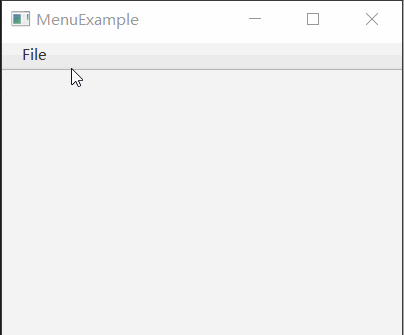

# 如何制作菜单

在 JavaFX 中，我们通过 MenuBar, Menu, MenuItem 来制作菜单。

MenuBar 是菜单栏，通常位于窗口顶部。

Menu 是一个菜单项，放在菜单栏上。

MenuItem 是一个菜单条目，位于 Menu 中。

## 效果展示



## 示例代码

```java {20-35}
import javafx.application.Application;
import javafx.scene.Scene;
import javafx.scene.control.Menu;
import javafx.scene.control.MenuBar;
import javafx.scene.control.MenuItem;
import javafx.scene.control.SeparatorMenuItem;
import javafx.scene.layout.VBox;
import javafx.stage.Stage;

public class MenuExample extends Application
{
    private Stage window;
    private MenuBar menuBar;

    private void exitProgram()
    {
        this.window.close();
    }

    private void buildMenu()
    {
        menuBar = new MenuBar();

        Menu fileMenu = new Menu("_File");
        menuBar.getMenus().add(fileMenu);

        MenuItem newMenuItem = new MenuItem("_New File");
        fileMenu.getItems().add(newMenuItem);
        MenuItem openMenuItem = new MenuItem("_Open File");
        fileMenu.getItems().add(openMenuItem);
        fileMenu.getItems().add(new SeparatorMenuItem());
        MenuItem exitMenuItem = new MenuItem("_Exit");
        fileMenu.getItems().add(exitMenuItem);
        exitMenuItem.setOnAction( e-> exitProgram() );
    }

    @Override
    public void start(Stage window) throws Exception
    {
        this.window = window;

        VBox vBox = new VBox();

        this.buildMenu();
        vBox.getChildren().add(menuBar);

        Scene scene = new Scene(vBox, 400, 300);

        window.setScene(scene);
        window.setTitle(this.getClass().getSimpleName());
        window.show();
    }

    public static void main(String[] args)
    {
        launch(args);
    }
}
```

**代码说明**

我们通过 new MenuBar();` 创建了菜单栏，`new Menu("_File");` 创建了菜单项，然后用 `menuBar.getMenus().add` 方法将菜单项添加到菜单栏上。

注意，菜单项的名字前有一个下划线，但此下划线的作用并不是显示出来，而是表示后面的字母是一个快捷键。即如果按住 ALT + F 就可以快速选择菜单。

`new MenuItem` 用于创建菜单项目，然后可通过 `menu.getItems().add` 将其添加到一个菜单上。

`menuItem.setOnAction` 为菜单项目设置一个回调函数，但点击菜单项目时，可触发。

`new SeparatorMenuItem()` 是一个特殊的菜单，可显示一个分隔符号。

## 总结

我们可以使用 MenuBar、Menu 和 MenuItem 来创建菜单。步骤如下：

1. 创建一个 MenuBar 对象作为菜单栏，并将其放置在窗口的顶部
2. 创建 Menu 对象作为菜单项，并将其添加到菜单栏上
3. 使用 MenuItem 创建菜单条目，并将其添加到相应的菜单中
4. 可以使用 SeparatorMenuItem 添加分隔符来组织菜单项
5. 为 MenuItem 设置事件处理程序，以在用户点击菜单项时执行相应的操作