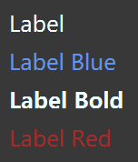

# 如何在JavaFX中使用CSS

CSS用于定制用户界面的显示样式。JavaFX 也可以通过 css 文件来支持 CSS 。

对于 JavaFX 中的元素，有的会有默认的规则，我们对这个规则设置 CSS 样式，就可以修改其关联的元素的显示效果。

比如，Label 控件关联的规则名是 `.label` ，如果我们在 CSS 文件中加入：

```css
.label {
    -fx-text-fill: #F0FFFF;
}
```

那么所有 Label 默认会应用这种样式。

`.root` 规则对应的是根节点的样式，其某些设置会影响到子节点。比如：

```css
.root {
    -fx-background-color: #383838;
    -fx-font-size: 24
}
```

- `-fx-background-color: #383838;` 这句话设置了场景的背景颜色。

- `-fx-font-size: 24` 这句话设置了子节点的字体大小。

我们也可以自定义规则，然后应用。

## 效果展示

下面是一个使用了 CSS 样式的显示展示：



## 示例代码

CSS 文件代码：

```css
.root {
    -fx-background-color: #383838;
    -fx-font-size: 24
}

.label {
    -fx-text-fill: #F0FFFF;
}

.label-blue {
    -fx-text-fill: #6495ED;
}

#label-bold {
    -fx-font-weight: bold;
}
```

Java 文件代码：

```java
import javafx.application.Application;
import javafx.geometry.Insets;
import javafx.scene.Scene;
import javafx.scene.control.Button;
import javafx.scene.control.Label;
import javafx.scene.layout.VBox;
import javafx.stage.Stage;

public class CSSExample extends Application
{
    @Override
    public void start(Stage window) throws Exception
    {
        VBox vBox = new VBox();
        vBox.setPadding(new Insets(10));
        vBox.setSpacing(10);

        Label label = new Label("Label");
        vBox.getChildren().add(label);

        Label labelBlue = new Label("Label Blue");
        labelBlue.getStyleClass().add("label-blue");
        vBox.getChildren().add(labelBlue);

        Label labelBold = new Label("Label Bold");
        labelBold.setId("label-bold");
        vBox.getChildren().add(labelBold);

        Label labelRed = new Label("Label Red");
        labelRed.setStyle("-fx-text-fill: #A52A2A");
        vBox.getChildren().add(labelRed);

        Scene scene = new Scene(vBox);
        scene.getStylesheets().add("cssexample.css");

        window.setScene(scene);
        window.setTitle(this.getClass().getSimpleName());
        window.show();
    }

    public static void main(String[] args)
    {
        launch(args);
    }
}
```

**代码说明**

- 我们使用 `scene.getStylesheets().add("cssexample.css");` 加载 CSS 文件，从而得到CSS规则的设定
- `labelBlue.getStyleClass().add("label-blue");` 这句话使用了自定义的规则 label-blue 中的设定来替代默认设定 （同时保留其他样式）
- `labelBold.setId("label-bold");` 这句话同样也是使用自定义的规则 label-bold 的设定来替代默认设定 （同时保留其他样式）
- `labelRed.setStyle("-fx-text-fill: #A52A2A");` 这句话将规则写入代码中，从而代替默认设定（同时保留其他样式）

## 总结

有三种方式来设定 CSS 样式：

1. 不使用CSS文件，而是将样式写入代码，通过调用 setStyle来设置
2. 使用 CSS 文件来设定默认规则
3. 使用 CSS 文件来新建规则，然后在代码里使用 setId 或 getStyleClass().add 来修改默认设定