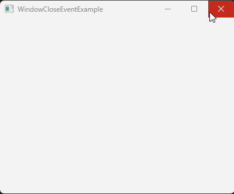

# 如何在关闭窗口时增加确认框

当我们点击窗口的关闭图标时，窗口马上会被关闭。如何增加一个确认框，当用户确认时才关闭窗口呢？



方法是为窗口 Stage 设置一个在关闭时的事件回调函数，在里面做相应的处理。

代码片段如下：

```java
window.setOnCloseRequest(e ->
{
    e.consume(); // 告诉 JavaFX 我们想自己处理窗口的关闭
    boolean isConfirmed = new ConfirmWindow().open("确认关闭窗口吗？");
    if (isConfirmed)
    {
        window.close();
    }
});
```

在窗口关闭时，会调用此 lambda 表达式。在 lambda 表达式中，我们：
1. 通过调用 `e.consume()` 取消了默认的窗口关闭行为
2. 然后通过确认框来确认关闭。关闭的方法是 `window.close()`

## 完整代码

```java
import javafx.application.Application;
import javafx.scene.Scene;
import javafx.scene.layout.VBox;
import javafx.stage.Stage;

public class WindowCloseEventExample extends Application
{
    @Override
    public void start(Stage window) throws Exception
    {
        VBox vBox = new VBox();

        Scene scene = new Scene(vBox, 400, 300);

        window.setScene(scene);
        window.setTitle(this.getClass().getSimpleName());
        window.setOnCloseRequest(e ->
        {
            e.consume(); // 告诉 JavaFX 我们想自己处理窗口的关闭
            boolean isConfirmed = new ConfirmWindow().open("确认关闭窗口吗？");
            if (isConfirmed)
            {
                window.close();
            }
        });
        window.show();
    }

    public static void main(String[] args)
    {
        launch(args);
    }
}
```

## 总结

如果我们想自己处理窗口的关闭，可以使用下面的步骤：
1. 调用 `window.setOnCloseRequest` 设置窗口关闭时的处理函数
2. 调用 `e.consume()` 取消默认的关闭行为
3. 自行调用 `window.close()` 来关闭窗口，比如打开一个确认框并确认后