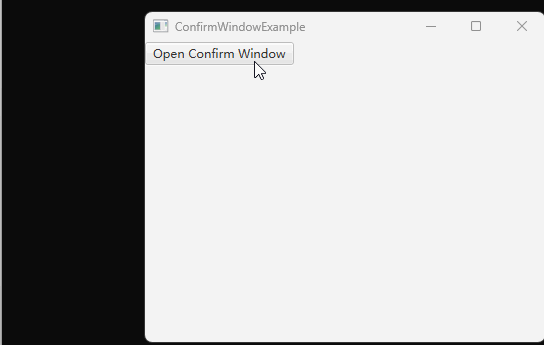

# 如何在窗口之间交互 以实现一个确认框为例

有时候我们需要知道在另一个窗口关闭时，知道用户对此窗口的操作情况。比如典型的确认框：



这种情况下，我们需要调用 `window.showAndWait()` 方法，程序将等待窗口的关闭。

## 完整代码示例

下面代码由两个类组成：
1. ConfirmWindow 实现了一个简单的确认框
2. ConfirmWindowExample 启动了主窗口，然后通过一个按钮打开确认框，并等待确认结果

```java
import javafx.application.Application;
import javafx.geometry.Insets;
import javafx.scene.Scene;
import javafx.scene.control.Button;
import javafx.scene.control.Label;
import javafx.scene.layout.HBox;
import javafx.scene.layout.VBox;
import javafx.stage.Modality;
import javafx.stage.Stage;

class ConfirmWindow
{
    private boolean isConfirmed;
    private Stage confirmWindow;

    public boolean open(String content)
    {
        isConfirmed = false;

        VBox vBox = new VBox();
        vBox.setPadding(new Insets(10));
        vBox.setSpacing(10);

        Label contentLabel = new Label(content);
        vBox.getChildren().add(contentLabel);

        HBox confirmHBox = new HBox();
        confirmHBox.setSpacing(10);
        {
            // 添加确认、取消两个按钮
            Button confirmButton = new Button("确认");
            confirmButton.setDefaultButton(true);
            Button cancelButton = new Button("取消");
            confirmHBox.getChildren().addAll(confirmButton, cancelButton);

            confirmButton.setOnAction(e -> {
                isConfirmed = true;
                confirmWindow.close();
            });

            cancelButton.setOnAction(e -> {
                isConfirmed = false;
                confirmWindow.close();
            });
        }
        vBox.getChildren().add(confirmHBox);

        Scene scene = new Scene(vBox);

        confirmWindow = new Stage();
        confirmWindow.initModality(Modality.APPLICATION_MODAL);
        confirmWindow.setScene(scene);
        confirmWindow.showAndWait(); // 执行代码在此处暂停，当窗口关闭后继续执行后面的代码，即 return 一个确认状态

        return isConfirmed;
    }
}

public class ConfirmWindowExample extends Application
{
    @Override
    public void start(Stage window) throws Exception
    {
        VBox vBox = new VBox();

        Button button = new Button("Open Confirm Window");
        button.setOnAction(e -> 
        {
            boolean isConfirmed = new ConfirmWindow().open("你确认吗？"); // 执行代码在此处暂停，等待 openConfirmWindow 返回
            if (isConfirmed)
            {
                System.out.println("Confirmed");
            }
            else
            {
                System.out.println("Not Confirmed");
            }
        });

        vBox.getChildren().add(button);

        Scene scene = new Scene(vBox, 400, 300);

        window.setScene(scene);
        window.setTitle(this.getClass().getSimpleName());
        window.show();
    }

    public static void main(String[] args)
    {
        launch(args);
    }
}
```

上述代码有几点注意：
1. confirmWindow 没有给 Scene 设置宽高，那么它将自动调整为主布局的大小，而主布局的大小又会根据控件的添加而调整
2. setSpacing 的意思是设置布局内控件的至少间隔多少像素
3. setPadding 的意思是设置布局内的控件和布局边缘的距离至少间隔多少像素
4. 注意到 confirmButton 调用了 `setDefaultButton(true)` ，这是将其设置为主按钮，从而获得一个特殊的颜色（windows下是蓝色按钮）

**总结**

我们可以通过 showAndWait 方法等待一个窗口关闭。

和一个窗口交互的步骤如下：
1. 写一个函数，在其中新建一个窗口
2. 调用此窗口的 showAndWait 来显示
3. 在 showAndWait 方法后，return 要返回的内容