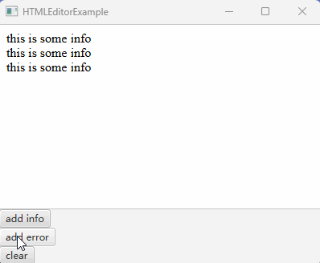

# 如何实现带有颜色文本的日志框_使用HTMLEditor模拟

HTMLEditor 是一个强大的 html 编辑器，可以方便的编辑各种 html 元素并得到 html 文本。

比之 TextArea 要强大很多，因为 TextArea 中所有的文本只能有一种样式。

如果想要实现一个日志框，其中普通信息、警告信息、错误信息使用不同颜色的文本，甚至支持超链接的话，使用 TextArea 就无法实现了。

借用 HTMLEditor 似乎是一个比较简单的做法。

## 效果展示



## 示例代码

代码有两部分组成：

1. LogArea, 适配 HTMLEditor ，裁剪功能实现一个日志框
2. HTMLEditorExample, 用于测试 LogArea

LogArea 代码如下：

```java
import java.util.Set;

import javafx.concurrent.Worker;
import javafx.scene.Node;
import javafx.scene.web.HTMLEditor;
import javafx.scene.web.WebEngine;
import javafx.scene.web.WebView;

public class LogArea
{
    private HTMLEditor editor;
    
    public Node getNode()
    {
        if (editor == null)
        {
            this.init();
        }
        return editor;
    }    

    private void init()
    {
        editor = new HTMLEditor();

        // 设置添加文本时自动下拉
        {
            WebView webView = (WebView) editor.lookup("WebView");
            WebEngine webEngine = webView.getEngine();
            webEngine.getLoadWorker().stateProperty().addListener((observable, oldValue, newValue) -> {
                if (newValue == Worker.State.SUCCEEDED) {
                    webEngine.executeScript("window.scrollTo(0, document.body.scrollHeight)");
                }
            });
        }
        
        // 隐藏工具栏
        {
            editor.setVisible(false);
            Set<Node> nodes = editor.lookupAll(".tool-bar");
            for(Node node : nodes)
            {
                node.setVisible(false);
                node.setManaged(false);
            }
            editor.setVisible(true);
        }
    }

    public void logInfo(String message)
    {
        editor.setHtmlText(editor.getHtmlText() + message + "<br/>");
    }

    public void logError(String message)
    {
        editor.setHtmlText(editor.getHtmlText() + String.format("<span style=\"color: red\">%s</span>", message) + "<br/>");
    }

    public void clear()
    {
        editor.setHtmlText("");
    }
}
```

HTMLEditorExample 代码如下：

```java
import javafx.application.Application;
import javafx.scene.Scene;
import javafx.scene.control.Button;
import javafx.scene.layout.VBox;
import javafx.stage.Stage;

public class HTMLEditorExample extends Application
{
    @Override
    public void start(Stage window) throws Exception
    {
        VBox root = new VBox();
    
        LogArea logArea = new LogArea();
        root.getChildren().addAll(logArea.getNode());

        Button infoButton = new Button("add info");
        infoButton.setOnAction(e -> {
            logArea.logInfo("this is some info");
        });
        Button errorButton = new Button("add error");
        errorButton.setOnAction(e -> {
            logArea.logError("this is some error");
        });
        Button clearButton = new Button("clear");
        clearButton.setOnAction(e -> {
            logArea.clear();
        });
        root.getChildren().addAll(infoButton, errorButton, clearButton);

        Scene scene = new Scene(root, 400, 300);

        window.setScene(scene);
        window.setTitle(this.getClass().getSimpleName());
        window.show();
    }

    public static void main(String[] args)
    {
        launch(args);
    }
}
```

**代码说明**

HTMLEditor 没提供类似 appendText 这样的方法来追加文本，所以 LogArea 添加了这个功能，作为添加日志的接口。

在 LogArea 的 init 方法中初始化并调整 HTMLEditor ，令其每次添加文本后都执行一段 js 代码，作用是将下拉框保持到最底部。

另外隐藏了 HTMLEditor 的工具栏，因为日志框不需要手动编辑内容。