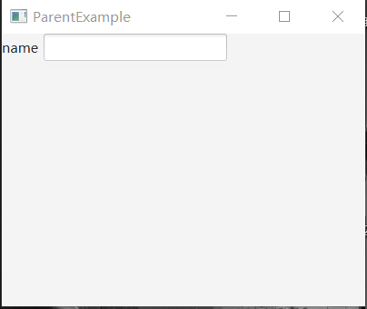

# 如何实现自定义控件_通过继承Parent

有时，我们会有这样的想法：将多个控件组合在一起，抽象成一个控件，从而方便使用。

比如，我们经常将 Label 和 TextField 组合在一起，作为一个输入框。

那么如何实现这样的组合呢？

有一个简单的方案：继承 Parent 类。

当一个类继承 Parent 类后，它的实例就可以加入到场景图中了。

## 效果展示



## 示例代码

```java
import javafx.application.Application;
import javafx.geometry.Insets;
import javafx.geometry.Pos;
import javafx.scene.Parent;
import javafx.scene.Scene;
import javafx.scene.control.Label;
import javafx.scene.control.TextField;
import javafx.scene.layout.HBox;
import javafx.scene.layout.VBox;
import javafx.stage.Stage;

public class ParentExample extends Application {

    private static class Input extends Parent {
        
        public Input(String notice) {
            HBox hBox= new HBox(5);
            hBox.setAlignment(Pos.CENTER);
            
            Label label = new Label(notice);
            TextField textField = new TextField();
            hBox.getChildren().addAll(label, textField);

            this.getChildren().add(hBox);
        }
    }

    private Parent createContent() {
        VBox root = new VBox();

        Input input = new Input("name");
        
        root.getChildren().add(input);

        return root;
    }

    @Override
    public void start(Stage primaryStage) throws Exception {
        primaryStage.setTitle(this.getClass().getSimpleName());
        Scene scene = new Scene(createContent(), 400, 300);
        primaryStage.setScene(scene);
        primaryStage.show();
    }
    
    public static void main(String[] args) {
        launch(args);
    }
}
```

**代码说明**

在这个例子中，静态内部类 Input 继承了 Parent ，从而可以加入场景图中。

在 Input 的构造函数中，放置了要显示的控件：一个 Label 和 一个 TextField ，并且将他们布局到一个 HBox 中去。

注意，继承自 Parent 的类，将不会自动适应父控件的宽高，而是根据子控件来自动扩展其大小 。