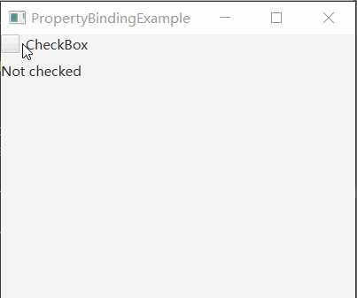

# 如何将不同类型的Property绑定_使用绑定表达式

我们知道，相同的 Property 可以直接调用 bind 进行绑定。

而不同类型的 Property 则不能。

现在，我想令 textProperty 和 booleanProperty 进行绑定：

当 booleanProperty 为 true 或 false 时，同步修改 textProperty.

那么，有何方案？

使用**绑定表达式**可以作为一个解决方案。

## 效果展示



## 示例代码

```java
import javafx.application.Application;
import javafx.beans.binding.Bindings;
import javafx.scene.Parent;
import javafx.scene.Scene;
import javafx.scene.control.CheckBox;
import javafx.scene.control.Label;
import javafx.scene.layout.VBox;
import javafx.stage.Stage;

public class PropertyBindingExample extends Application {

    private Parent createContent() {
        VBox root = new VBox(10);

        CheckBox CheckBox = new CheckBox("CheckBox");
        Label label = new Label("Not checked");

        label.textProperty().bind(Bindings.when(CheckBox.selectedProperty()).then("Checked").otherwise("Not checked"));

        root.getChildren().addAll(CheckBox, label);

        return root;
    }

    @Override
    public void start(Stage primaryStage) throws Exception {
        primaryStage.setTitle(this.getClass().getSimpleName());
        primaryStage.setScene(new Scene(createContent(), 400, 300));
        primaryStage.show();
    }

    public static void main(String[] args) {
        launch(args);
    }
    
}
```

**代码说明**

在这段代码中，我们使用下面一行代码完成了从 textProperty 到 booleanProperty 的绑定：

```java
label.textProperty().bind(Bindings.when(CheckBox.selectedProperty()).then("Checked").otherwise("Not checked"));
```

在 `label.textProperty().bind(...)` 中，`...` 可以是一个绑定表达式。

表达式的内容是：

```java
Bindings.when(CheckBox.selectedProperty()).then("Checked").otherwise("Not checked")
```

这段表达式的意思是，当 `CheckBox.selectedProperty()` 为 true 的时候，绑定到内容 Checked, 否则绑定到内容 Not checked. 