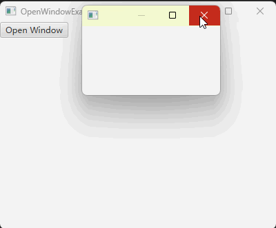

# 如何打开新的窗口

JavaFX 程序有一个主窗口，就是 start 函数的第一个参数。有时我们还想打开新的窗口，比如一个提示窗口。

效果如下：



应该怎样打开新窗口呢？

方法就是创建一个新的 Stage ，然后设置它的 Scene ，调用如 `window.show()` 这样的方法。

下面是一个打开一个新窗口的代码例子：

```java
private void openWindow()
{
    VBox vBox = new VBox();

    Scene scene = new Scene(vBox, 200, 100);

    Stage newWindow = new Stage();
    newWindow.initModality(Modality.APPLICATION_MODAL); // 设置此模式，则窗口打开时，其他窗口无法操作
    newWindow.setScene(scene);
    newWindow.show();
}
```

一个新的窗口就是一个 Stage ，我们要为其设置一个 Scene ，Scene 设置一个根 Layout 。后面我们就可以往这个根 Layout 里面放置具体的内容了。

新打开的窗口可能需要调用 initModality 方法来设置一个模式，比如 `Modality.APPLICATION_MODAL` 表示窗口打开时，其他窗口无法操作。

如果不设置模式，那么默认情况其他窗口还可以操作。

## 问：什么时候程序会退出，是主窗口关闭时还是所有窗口关闭时

由于打开了新的窗口，因此我们的程序至少有两个窗口会同时显示，那么我们的程序在什么时候会关闭呢？

猜想可能的情况就是：

1. 主窗口关闭时
2. 所有窗口关闭时

经过测试发现，只有**当所有窗口关闭时，程序才会退出**（也就是从终端窗口看出，程序已退出）。

## 完整代码示例

```java
import javafx.application.Application;
import javafx.scene.Scene;
import javafx.scene.control.Button;
import javafx.scene.layout.VBox;
import javafx.stage.Modality;
import javafx.stage.Stage;

public class OpenWindowExample extends Application
{
    private void openWindow()
    {
        VBox vBox = new VBox();

        Scene scene = new Scene(vBox, 200, 100);

        Stage newWindow = new Stage();
        newWindow.initModality(Modality.APPLICATION_MODAL); // 设置此模式，则窗口打开时，其他窗口无法操作
        newWindow.setScene(scene);
        newWindow.show();
    }

    @Override
    public void start(Stage window) throws Exception
    {
        VBox vBox = new VBox();

        Button openButton = new Button("Open Window");
        openButton.setOnAction( e -> openWindow() );
        vBox.getChildren().add(openButton);

        Scene scene = new Scene(vBox, 400, 300);

        window.setScene(scene);
        window.setTitle(this.getClass().getSimpleName());
        window.show();
    }

    public static void main(String[] args)
    {
        launch(args);
    }
}
```

## 总结

要想打开新的窗口，步骤如下：

1. 通过 `new Stage()` 创建一个新的窗口
2. 初始化 Scene 和根布局，然后调用 setScene 设置主窗口
3. 调用 initModality 设置窗口模式，比如窗口打开时，其他窗口不能操作，就设置为 Modality.APPLICATION_MODAL
4. 调用如 `window.show()` 来显示窗口