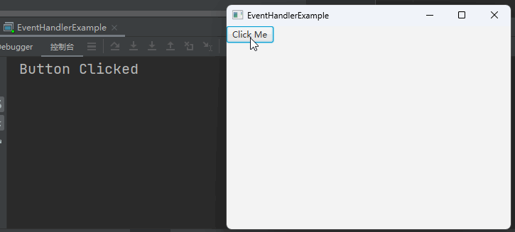

# 如何接收用户事件_以Button点击为例

JavaFX 中与用户进行交互的方式可以通过事件的回调。我们可以给一个控件（比如 Button ）绑定一个事件回调函数，但相关事件触发时（比如 Button 被点击），JavaFX 将调用这个回调函数。

以 Button 为例，在我们创建好 Button 后，调用 setOnAction 方法为其设置一个回调函数：

```java
Button button = new Button("Click Me");
button.setOnAction( e -> onButtonClick() );
vBox.getChildren().add(button);
```

setOnAction 接受一个函数式接口，因此我们可以传递一个 lambda 表达式，在这里，我把具体的处理代码写在了 `onButtonClick` 这个函数里：

```java
private void onButtonClick()
{
    System.out.println("Button Clicked");
}
```

现在，当我们点击按钮时，就会得到如下的效果：



## 代码示例

```java
import javafx.application.Application;
import javafx.scene.Scene;
import javafx.scene.control.Button;
import javafx.scene.layout.Pane;
import javafx.scene.layout.VBox;
import javafx.stage.Stage;

public class EventHandlerExample extends Application
{
    private void onButtonClick()
    {
        System.out.println("Button Clicked");
    }

    private Pane buildLayout()
    {
        VBox vBox = new VBox();

        Button button = new Button("Click Me");
        button.setOnAction( e -> onButtonClick() );
        vBox.getChildren().add(button);

        return vBox;
    }

    @Override
    public void start(Stage window) throws Exception
    {
        Scene scene = new Scene(this.buildLayout(), 400, 300);
        window.setScene(scene);
        window.setTitle(this.getClass().getSimpleName());
        window.show();
    }

    public static void main(String[] args)
    {
        launch(args);
    }
}
```

## 总结

接收用户事件的方式是采用事件的回调，具体步骤是：

1. 初始化好一个控件
2. 调用控件的设置事件回调的方法，传递一个 lambda 表达式（或匿名内部类，或对应的接口实现）
3. 将控件安装到场景图中（也就是添加到父节点中）