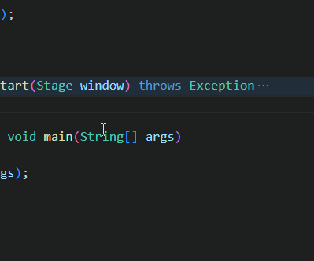

# 如何正确在多线程环境下更新UI_使用Platform的runLater方法

许多UI控件都提供了各种修改方法，比如我们可以修改 Label 上面的文本，进度条 ProgressBar 的进度。

但我们必须保证修改UI的线程是 JavaFX 的UI线程，如果不是则会出现异常。

那么我们如何在另一个线程中修改 JavaFX 的UI呢？方法是使用 Platform.runLater 。

## 效果展示



## 示例代码

```java {12-16}
import javafx.application.Application;
import javafx.application.Platform;
import javafx.scene.Scene;
import javafx.scene.control.ProgressBar;
import javafx.scene.layout.VBox;
import javafx.stage.Stage;

public class RunLaterExample extends Application
{
    private ProgressBar progressBar;

    private void updateProgress(String message, int percent)
    {
        System.out.println(message);
        Platform.runLater(() -> progressBar.setProgress(percent * 0.01) );
    }

    private static void sleepSecond(int second)
    {
        try
        {
            Thread.sleep(second * 1000);
        }
        catch (Exception e)
        {
        }
    }

    private void startInitThread()
    {
        new Thread(() -> {

            sleepSecond(2);
            this.updateProgress("Init step 1...", 30);
            
            sleepSecond(2);
            this.updateProgress("Init step 2...", 50);

            sleepSecond(2);
            this.updateProgress("Init step 3...", 70);
            
            sleepSecond(2);
            this.updateProgress("Init finish", 100);

        }).start();
    }

    @Override
    public void start(Stage window) throws Exception
    {
        startInitThread();

        VBox vBox = new VBox();

        progressBar = new ProgressBar(0);

        vBox.getChildren().add(progressBar);

        Scene scene = new Scene(vBox, 400, 300);

        window.setScene(scene);
        window.setTitle(this.getClass().getSimpleName());
        window.show();
    }

    public static void main(String[] args)
    {
        launch(args);
    }
}
```

**代码说明**

这段代码创建了一个 ProgressBar ，并在另一个线程中更新它。

程序启动后，调用 startInitThread 创建了一个新的线程，模拟程序初始化过程，并通过调用 updateProgress 来更新进度条。

我们使用 `Platform.runLater(() -> progressBar.setProgress(percent * 0.01) );` 来确保修改进度条的操作在 JavaFX 的UI线程中。

## 总结

我们必须确保在 JavaFX UI 线程中修改 UI 。如果在另一个线程要这么做，就需要通过使用 `Platform.runLater` 方法将修改的操作提交过去。