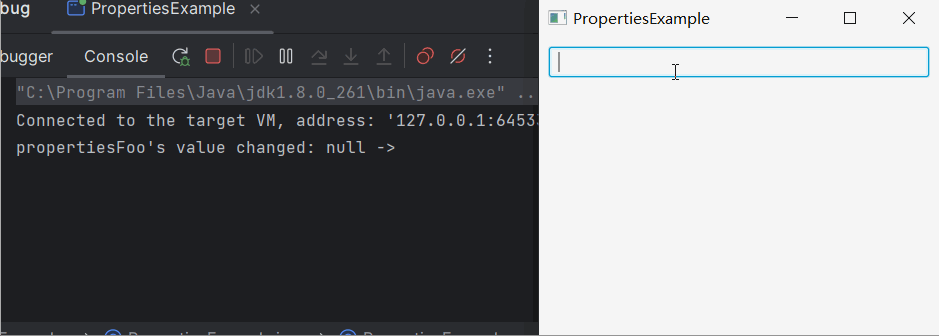

# 如何绑定Property以实现控件属性同步

控件的属性往往是各种 Property ，比如 StringProperty, IntegerProperty 。它们有着特殊的性质：

- 可以在其上添加一个监听函数，在属性发生变化时自动调用
- 可以绑定另一个 Property ，从而同步变更

## 效果展示



## 示例代码

```java
import javafx.application.Application;
import javafx.beans.property.SimpleStringProperty;
import javafx.beans.property.StringProperty;
import javafx.geometry.Insets;
import javafx.scene.Scene;
import javafx.scene.control.Label;
import javafx.scene.control.TextField;
import javafx.scene.layout.VBox;
import javafx.stage.Stage;

class PropertiesFoo
{
    public String getValue() {
        return value.get();
    }

    public StringProperty valueProperty() {
        return value;
    }

    public void setValue(String value) {
        this.value.set(value);
    }

    private StringProperty value = new SimpleStringProperty();
}

public class PropertiesExample extends Application
{
    @Override
    public void start(Stage window) throws Exception
    {
        VBox vBox = new VBox();
        vBox.setPadding(new Insets(10));
        vBox.setSpacing(10);

        TextField textField = new TextField();
        Label label = new Label();
        label.textProperty().bind(textField.textProperty());
        
        PropertiesFoo propertiesFoo = new PropertiesFoo();
        propertiesFoo.valueProperty().addListener(( v, oldValue, newValue ) -> {
            System.out.println(String.format("propertiesFoo's value changed: %s -> %s", oldValue, propertiesFoo.getValue()));
        } );
        propertiesFoo.valueProperty().bind(label.textProperty());
        
        vBox.getChildren().addAll(textField, label);

        Scene scene = new Scene(vBox, 400, 300);

        window.setScene(scene);
        window.setTitle(this.getClass().getSimpleName());
        window.show();
    }

    public static void main(String[] args)
    {
        launch(args);
    }
}
```

**代码说明**

这段代码我们定义了一个自定义的类 PropertiesFoo ，它管理着一个数据成员 StringProperty 。

通过调用 `propertiesFoo.valueProperty().addListener` 为其添加了变化监听函数，当其数据发生变化时被调用。

通过调用 `propertiesFoo.valueProperty().bind` 将其内容绑定到 label 的 Property ，从而当 label 内容变化时，propertiesFoo 也跟着变化。

而 label 又绑定到了 textField ，因此当 textField 内容发生改变时，label 也会跟着改变。

## 总结

通过绑定 Property 可以实现控件属性的同步。