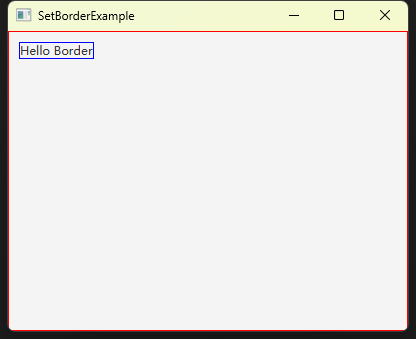

# 如何给布局或者控件添加边框

我在学习和开发 JavaFX 程序时，对 Pane 会有一些疑问，比如：

- 它们的大小是怎样的？
- 它们的大小和父节点或者窗口的关系是怎样的？

相同的问题在控件上也存在，比如一个 Label 到底占据了多大的空间（因为默认 Label 没有边框展示）？

我想，如果可以给布局或者控件添加上边框，可以更加清晰直观的看到答案。

Pane 和 Control 都有一个 setBorder 的方法用于设置边框。

我的测试方法如下：

```java
private static void setDebugBorderForPane(Pane pane)
{
    BorderStroke borderStroke = new BorderStroke(Color.RED, BorderStrokeStyle.SOLID, null, null);
    Border border = new Border(borderStroke);
    pane.setBorder(border);
}

private static void setDebugBorderForControl(Control control)
{
    BorderStroke borderStroke = new BorderStroke(Color.BLUE, BorderStrokeStyle.SOLID, null, null);
    Border border = new Border(borderStroke);
    control.setBorder(border);
}
```

这两个方法分别为布局和控件设置测试边框，为布局设置的是红色实线边框，而为控件设置的是蓝色实线边框。

BorderStroke 构造函数的第三个参数是设置边角的样式，第四个参数是设置边框的宽度，用不上的话传 null 就可以了。

经过测试，我发现，当我把 VBox 作为根布局传递给 Scene 时，VBox的大小刚好填满了整个窗口，而且会随着窗口的大小变化而变化，随时保持填充的状态。

如下：



完整的代码如下：

```java
import javafx.application.Application;
import javafx.geometry.Insets;
import javafx.scene.Scene;
import javafx.scene.control.Control;
import javafx.scene.control.Label;
import javafx.scene.layout.Border;
import javafx.scene.layout.BorderStroke;
import javafx.scene.layout.BorderStrokeStyle;
import javafx.scene.layout.Pane;
import javafx.scene.layout.VBox;
import javafx.scene.paint.Color;
import javafx.stage.Stage;

public class SetBorderExample extends Application
{
    private static void setDebugBorderForPane(Pane pane)
    {
        BorderStroke borderStroke = new BorderStroke(Color.RED, BorderStrokeStyle.SOLID, null, null);
        Border border = new Border(borderStroke);
        pane.setBorder(border);
    }

    private static void setDebugBorderForControl(Control control)
    {
        BorderStroke borderStroke = new BorderStroke(Color.BLUE, BorderStrokeStyle.SOLID, null, null);
        Border border = new Border(borderStroke);
        control.setBorder(border);
    }

    private Pane buildLayout()
    {
        VBox vBox = new VBox();
        vBox.setPadding(new Insets(10)); // 设置控件距离布局上下左右边的距离至少为10像素
        setDebugBorderForPane(vBox);

        Label label = new Label("Hello Border");
        setDebugBorderForControl(label);
        vBox.getChildren().add(label);

        return vBox;
    }

    @Override
    public void start(Stage window) throws Exception
    {
        Scene scene = new Scene(this.buildLayout(), 400, 300);
        window.setScene(scene);
        window.setTitle(this.getClass().getSimpleName());
        window.show();
    }

    public static void main(String[] args)
    {
        launch(args);
    }
}
```

**总结**

为布局或者控件设置边框的方法是：

1. 定义一个 BorderStroke ，用于设置边框的样式
2. 定义一个 Border 对象，用 BorderStroke  初始化
3. 调用 setBorder 方法，将 Border 对象传入，从而设置边框