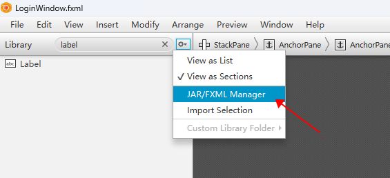

# README


此项目是一个登录框的模板。使用了第三方库 fontawesomefx ，因此需要手动引入。

引入方法：

打开 IDEA，选择：文件 -> 项目结构 -> 库，点击+号把lib目录下的 fontawesomefx-8.9.jar 添加进来。

在 SceneBuilder 中引入，方法如下图：




## 如何在 vscode 下运行？

首先确保安装了插件：Debugger for Java

然后引入库：

crtl + shift + p 打开输入框，输入：Java Configure Classpath

找到 Referenced Libraries，点击 Add 按钮，把 fontawesomefx-8.9.jar 添加进来。

然后即可正常运行程序。

## 如何使用maven引入 fontawesomefx 库？

加入依赖：

```xml
<dependency>
  <groupId>de.jensd</groupId>
  <artifactId>fontawesomefx</artifactId>
  <version>8.9</version>
</dependency>
```
